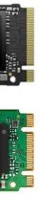

# SSD的記錄

SSD硬碟是什麼，可以做什麼，有什麼缺點，優點又是什麼

SSD硬碟，可以說是電腦的延年益壽的仙丹，為什麼這樣說呢? 以如今的硬體技術基本上只要你運氣不差，電腦可以用個十年以上不是問題，而其中最容易故障或者拖慢速度的就是傳統硬碟了，尤其是2.5吋的筆電硬碟，5400轉速，用個1年多你就覺得你的電腦慢到太不專業了，這時你換個*SSD硬碟*立刻生龍活虎原地復活。

SSD硬碟的儲存方式跟傳統硬碟不同，可以用來加速你的硬碟存取速度，但每一個存取的單元又有次數的限制。

所以SSD最大的優勢是快，以下分二個部份看

* SSD的處理方式
  1. SLC 一個位子可以存1個資炓
  2. MLC 一個位子可以存2個資炓
  3. TLC 一個位子可以存3個資炓
  4. QLC 一個位子可以存4個資炓

    
    以上的1,2,3,4個資料就表示容量的倍增，也就說明為什麼硬碟入手價不變但容量變大了，但就如同上面講的SSD的限制是一個位子可以存取的次數是有限的，所以QLC的容量大了但使用時間也短了，可是也不太考量他，現在大家都雲儲存，正常用SSD也可以用個3,5年不會有事，但如果你常在搬檔，下載YY那就可想一想2年換個硬碟，或增加一個傳統硬碟來備份。
    

* SSD的介面
  1. SATA 就是傳統的硬碟介面，但速度也受限在一定的程度，就像超跑開在路上一樣。
  2. PCIe 插槽式的介面，速度還是受限，但至少可以上到高速公路等級。
  
    M.2（NVMe） 說明卡的尺寸大小和外型 大小有42*22mm、60*22mm、80*22mm，
    長像有M.2SATA 跟M2.2 NVMe，下圖上面是NVMe(速度快)，下面是M.2 SATA，所以在換筆電硬碟時不要買錯了。

  

    結論是換成SSD硬碟可以變快，原來不能用的電腦也可以用了，但SSD有普通快，跟更快了二種介面，那就要看電腦主機版支援那種了。

    當然你要在一群超跑找一台比較快的，可以找到，但是差別不大，除非你能重金打造一條更快的公路，像把二個超跑做成一台來用。
